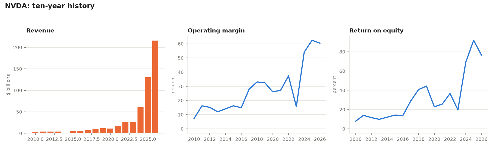
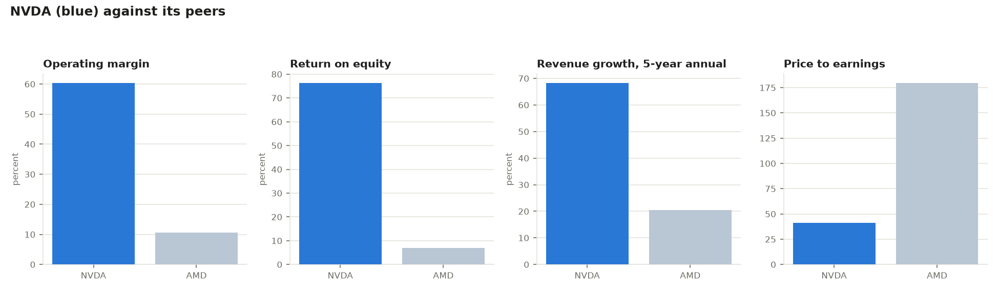

# stock-checklist

Builds an analyst-style tear sheet and a comparable-company table for any US public
company, straight from its SEC filings.

Give it a ticker and its peers. It pulls ten years of XBRL data from EDGAR, computes
the margins, returns, leverage, dividend and valuation measures an analyst would put
on one page, flags what deserves a second look, and links the filing sections that no
tool can read for you.

```
python 01_fetch_company.py AAPL MSFT GOOGL
python 02_metrics.py
python 03_tearsheet.py
python 04_comps.py
```

Output: `output/AAPL_tearsheet.md`, `output/AAPL_history.png`, `output/comps.csv`,
`output/comps.png`, plus a per-year fundamentals CSV for each company.

**Not investment advice.** It computes the measurable half of an investment checklist
so your attention goes to the half that takes reading and judgment. See
[docs/checklist.md](docs/checklist.md) for that split.

## Example

Run against real SEC filings: `python 01_fetch_company.py NVDA AMD`.





Both charts come straight out of NVIDIA's XBRL filings, the 2020 margin dip and the
2023–2026 run-up are both real, not decoration. Price is a manual snapshot
(`data/prices_manual.csv`), dated in the file; everything else is pulled live from
`data.sec.gov`.

## What the tear sheet contains

| Section | Measures |
|---|---|
| Snapshot | price, market cap, size bucket, growth/income label, revenue and its growth rate |
| Is it a good business? | gross, operating, net and free-cash-flow margins; return on equity and on invested capital; cash conversion latest and 5-year average |
| Can it survive a bad year? | total debt, cash, net debt, debt to equity, free cash flow |
| What do I pay? | P/E, P/B, EPS, dividend per share, yield, payout ratio, diluted shares |
| Worth a second look | automated flags: losses, dilution, uncovered dividend, heavy leverage, weak cash conversion, penny-stock territory |
| What this tool cannot tell you | the judgment questions, each with the 10-K section that answers it |

## Setup

Windows PowerShell, from the project folder.

**1. Environment and packages**

```powershell
if (-not (Test-Path .\01_fetch_company.py)) { Write-Host "STOP: not in the stock-checklist folder" }
else {
  if (-not (Test-Path .\.venv)) { python -m venv .venv }
  .\.venv\Scripts\Activate.ps1
  python -m pip install --upgrade pip
  python -m pip install -r requirements.txt
}
```

*Checkpoint:* the prompt starts with `(.venv)`.

**2. Settings**

```powershell
if (-not (Test-Path .\.env)) { Copy-Item .\.env.example .\.env }
notepad .env
```

- `SEC_USER_AGENT` is **required**: your name and a real email, like
  `Tayo Ortiz you@example.com`. The SEC rejects automated requests that don't identify
  themselves, and this is their stated rule rather than a formality.
- `ALPHAVANTAGE_API_KEY` is optional. Without it, valuation ratios stay blank unless
  you type prices into `data/prices_manual.csv`. The free tier allows 25 requests a
  day, so prices are cached once per day per ticker.

**3. Check**

```powershell
python 00_check_setup.py
```

*Checkpoint:* ends with "RESULT: Setup looks good."

**4. Run it**

```powershell
python 01_fetch_company.py AAPL MSFT GOOGL
python 02_metrics.py
python 03_tearsheet.py
python 04_comps.py
```

The first ticker is the subject; the rest are peers. One ticker works, but `04_comps.py`
needs at least two.

*Checkpoint, and the one that matters:* after `02_metrics.py`, open the company's
latest 10-K and check one revenue figure against the printed table. XBRL tags vary
between filers, and a silent tag mismatch is the one error that would corrupt
everything downstream without looking wrong.

**Without any keys:** `python 01_fetch_company.py --demo` builds three invented
companies so the pipeline runs end to end. Every output is labeled as fake.

## Tests

```powershell
python -m pytest -q
```

21 tests on the XBRL parsing (annual-only filtering, restatements, 52/53-week fiscal
years, tag fallbacks, tag switches mid-history) and the ratio math (missing tags,
zero denominators, classification thresholds).

## Reading the output honestly

- **A low P/E is not cheap.** Both P/E and P/B depend on what happens next, which no
  ratio knows. They're a starting question, not an answer.
- **Return on equity flatters leverage.** Read it beside debt to equity, and prefer
  return on invested capital.
- **Peers must be real peers.** The tool warns when SIC industries differ, but you
  choose the list, and a cheap-looking multiple against the wrong peers means nothing.
- **Financial companies break these ratios.** Banks and insurers are flagged; their
  leverage and margins aren't comparable to an industrial company's.
- **Everything is backward-looking.** Ten years of history describes what the company
  has done.

Full detail, including every tag mapping and seven known limitations:
[docs/methodology.md](docs/methodology.md).

## Data sources

- [SEC EDGAR APIs](https://www.sec.gov/search-filings/edgar-application-programming-interfaces)
  company facts, submissions. No key; a self-identifying `User-Agent` is required
  and the rate limit is 10 requests per second.
- [Alpha Vantage](https://www.alphavantage.co/support/#api-key) share prices,
  optional, 25 requests/day on the free tier.

Your key and everything downloaded stay local: `.gitignore` excludes `.env`,
`data/cache/` and `output/`.
